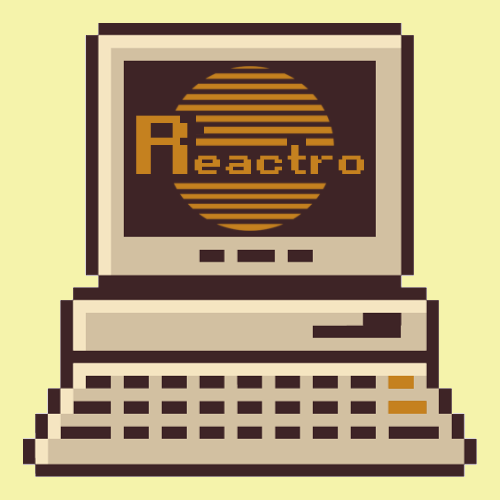

# Reactro UI

Reactro UI is a retro-inspired React component library with Typescript support.

[](https://badge.fury.io/js/reactro-ui-lib)



See all the available components on [Reactro UI's Storybook](https://melinamontelongo.github.io/reactro-ui)

## Installation

Run the following on your terminal inside the directory of any React project:
```shell


npm install reactro-ui-lib


```

Reactro UI uses [styled-components](https://styled-components.com/), so if you haven't already installed it, run the following as well:
```shell


npm install styled-components


```
## Usage

Once everything is installed, you can import any Reactro UI's component as seen on Storybook. 

Wrap everything with `ThemeProvider` and include `GlobalStyle` so the styles are correctly applied.

`ThemeProvider` accepts a `theme` prop, where you can choose from the currently available themes. 

```js
import { Button, GlobalStyle, ThemeProvider } from 'reactro-ui-lib';

<ThemeProvider>
    <GlobalStyle />
    <Button text="Click me" />
</ThemeProvider>
```
##  Copyright
This library was built by [Melina Montelongo](https://github.com/melinamontelongo) and is provided under the MIT license.
